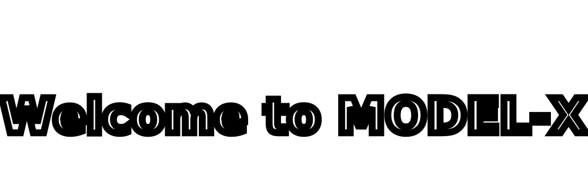

<div>
  
</div>

<div align="center">

<picture>
  <source media="(prefers-color-scheme: dark)" srcset="https://github.com/yourusername/yourrepo/raw/main/dark-bg.jpg">
  <source media="(prefers-color-scheme: light)" srcset="https://github.com/yourusername/yourrepo/raw/main/light-bg.jpg">
  
</picture>

# <span style="background: linear-gradient(90deg, #00f2fe, #ff00ff, #00ff88, #00f2fe); -webkit-background-clip: text; -webkit-text-fill-color: transparent; background-size: 300% 300%; animation: gradient-shift 3s ease infinite;">AnshGaur</span>
<br><span style="color: #00ff88; font-size: 1.2em; font-weight: bold;">Ultra-Fast LPU Inference</span>

<br><br>

[](https://reactjs.org/)
[](https://www.typescriptlang.org/)
[](https://groq.com)
[](https://llama.meta.com/)

<br>

[](https://github.com/yourusername/yourrepo)

<style>
@keyframes gradient-shift {
  0%, 100% { background-position: 0% 50%; }
  50% { background-position: 100% 50%; }
}
</style>

</div>

<p align="center">
  <b>Ansh Gaur</b><br>
  <i>A futuristic AI assistant powered by Groq's ultra-fast LPU inference</i>
</p>

<p align="center">
  
  
  
  
</p>

---

<br/>


<br/>

<a href="https://github.com/CelaDaniel" target="_blank">
  
</a>


## ⚡ What is NOVA?

NOVA is a sleek, futuristic AI assistant interface built with React + TypeScript, powered by **Groq's LPU (Language Processing Unit)** for lightning-fast responses. It features a stunning cyber-aesthetic UI with a glowing orb, real-time system log, and a smart auto-expanding input.

---

## 🔥 Features

| Feature | Description |
|---------|-------------|
| **⚡ Ultra-Fast AI** | Powered by Groq LPU — 750+ tokens/sec |
| **🌐 Multilingual** | Speaks Hindi, French, English and more |
| **🎨 Cyber UI** | Glowing orb, animated bars, futuristic theme |
| **📜 System Log** | Real-time scrollable conversation panel |
| **📝 Smart Input** | Auto-expanding textarea like ChatGPT |
| **🔒 Secure** | API key stored in `.env`, never exposed |

---

## 🏗️ Project Structure
```
MODEL-X/
├── src/
│   ├── components/
│   │   ├── NovaInterface.tsx   # Main futuristic UI
│   │   ├── ChatTab.tsx         # Chat component
│   │   ├── VisionTab.tsx       # Camera + VLM
│   │   └── VoiceTab.tsx        # Voice pipeline
│   ├── styles/
│   │   └── NovaTheme.css       # Cyber aesthetic CSS
│   ├── App.tsx                 # App root
│   └── main.tsx                # React entry point
├── app.py                      # Flask backend (Groq API)
├── .env                        # API keys (never commit!)
├── .gitignore                  # Protects .env from GitHub
└── package.json
```

---

## 🔥 PROJECTS

<p align="center">
  <b>Ansh Gaur</b><br>
  <i>Showcasing specialized work in AI, Healthcare Intelligence & Voice Automation</i>
</p>

<p align="center">
  
  
  
</p>

---

<table>
<tr>
<td width="33%" align="center">

## 🤖 MODEL-X (NOVA)


</td>
<td width="33%" align="center"></td>
<td width="33%" align="center"></td>
</tr>

<tr>
<td valign="top">

### Futuristic AI Assistant
A React + TypeScript AI assistant with a stunning cyber UI powered by Groq's ultra-fast LPU inference engine.

**🔥 Key Features**
- **Ultra-Fast:** Groq LPU 750+ tok/s  
- **Cyber UI:** Glowing orb & animations  
- **Multilingual:** Hindi, French, English  
- **Secure:** `.env` protected API keys  

</td>
<td valign="top"></td>
<td valign="top"></td>
</tr>

<tr>
<td valign="top">

<details>
<summary><b>⚙️ How to Run MODEL-X</b></summary>

```bash
git clone https://github.com/anshxgaur/MODEL-X.git
cd MODEL-X
cd src
source venv/Scripts/activate
npm install
npm run dev


## 🛠️ Tech Stack

<p align="center">
  
  
  
  
  
</p>

---

## 🔒 Security

- API keys stored in `.env` — **never committed to GitHub**
- `.env` is listed in `.gitignore`
- Use `VITE_GROQ_API_KEY` for frontend, `GROQ_API_KEY` for backend

---

## 📄 License

MIT

---

<p align="center">Made with ❤️ by <b>Ansh Gaur</b></p>
```


